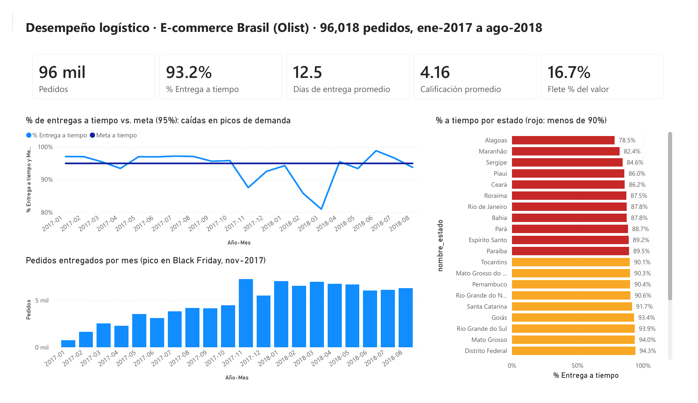
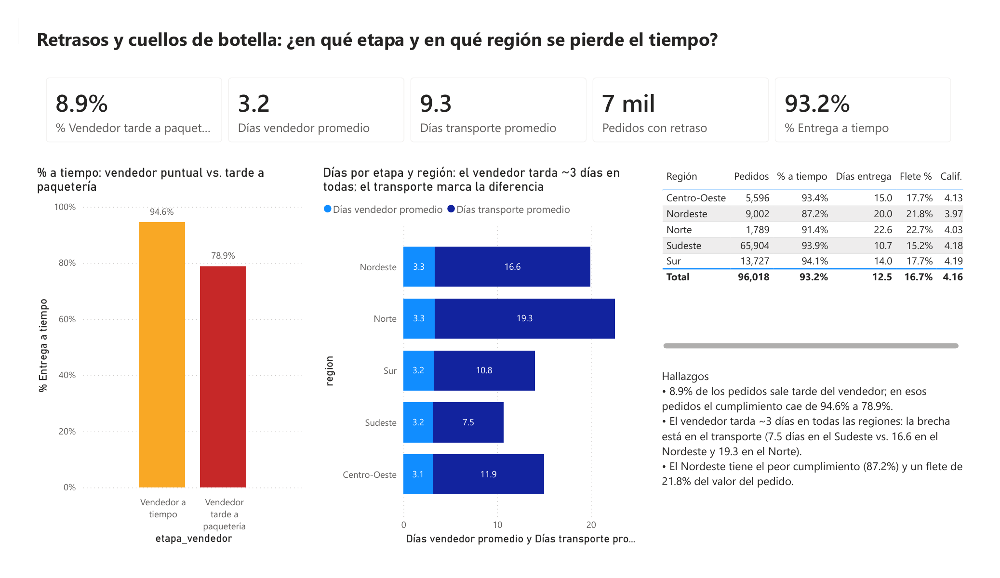
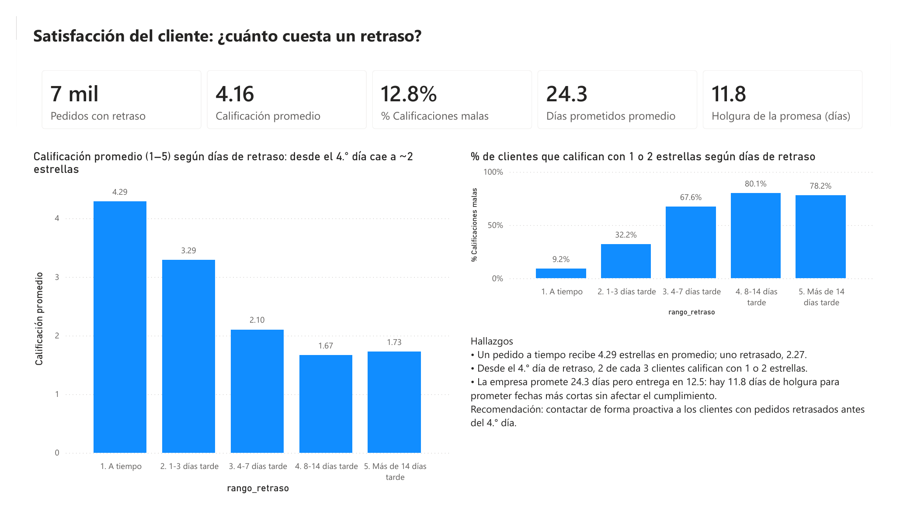

# 🚚 Desempeño logístico de un e-commerce: ¿dónde y por qué se retrasan las entregas?
### SQL (MySQL) + Power BI · 96,018 pedidos · Brasil 2017–2018

**Resultado principal:** el 93.2% de los pedidos llega a tiempo, pero un retraso le cuesta caro a la empresa: la calificación del cliente cae de **4.29 a 2.27 estrellas**, y con 4 a 7 días de retraso **el 68% de los clientes califica con 1 o 2 estrellas**. Cuando el vendedor entrega tarde a la paquetería, el riesgo de retraso se multiplica por **3.9**.





---

## 🎯 Problema de negocio
Olist, un marketplace brasileño, conecta a miles de vendedores con clientes en todo el país. El área de operaciones necesita responder:
1. ¿Qué tan bien cumplimos la fecha de entrega prometida y cómo evoluciona?
2. ¿En qué estados y en qué etapa (vendedor o transporte) se generan los retrasos?
3. ¿Cuánto afecta un retraso a la satisfacción del cliente?
4. ¿Dónde es más caro el flete y qué tan realista es la fecha que prometemos?

## 📁 Datos
- **Fuente:** [Brazilian E-Commerce Public Dataset by Olist](https://github.com/olist/work-at-olist-data) (licencia MIT): 99,441 pedidos reales anonimizados, de sep-2016 a oct-2018.
- **8 tablas relacionadas:** pedidos, artículos, clientes, vendedores, productos, pagos, reseñas y categorías (traducidas al español para este proyecto).

## 🧹 Limpieza y validación (SQL)
| Paso | Regla | Pedidos eliminados | Pedidos restantes |
|---|---|---|---|
| 0 | Datos originales | — | 99,441 |
| 1 | Solo pedidos entregados y con fechas de entrega completas | 2,972 | 96,469 |
| 2 | Solo meses completos (ene-2017 a ago-2018); 2016 y sep–oct 2018 tienen muy pocos pedidos | 267 | 96,202 |
| 3 | Sin fechas en orden imposible (p. ej. entrega a paquetería antes de la compra) | 184 | 96,018 |

Además: 547 pedidos con varias reseñas → calificación promediada por pedido; 610 productos sin categoría → etiquetados como "Sin categoría".

**Resultado:** 96,018 pedidos válidos para el análisis (96.6% del total).

## 🛠️ Proceso
```
CSV (8 tablas) → MySQL: modelo relacional con llaves primarias e índices
               → Validación de calidad de datos y tabla limpia (CTEs)
               → 9 preguntas de negocio con SQL (JOINs, CTEs, LAG, RANK)
               → Vistas en esquema estrella → Power BI (DAX) → Dashboard de 3 páginas
```

| Archivo | Qué hace |
|---|---|
| [`01_crear_tablas.sql`](01_crear_tablas.sql) | Crea la base de datos y 8 tablas con llaves e índices |
| [`02_cargar_datos.sql`](02_cargar_datos.sql) | Carga los CSV con `LOAD DATA`, convierte vacíos en `NULL` |
| [`03_limpieza_validacion.sql`](03_limpieza_validacion.sql) | Diagnóstico de calidad y tabla limpia con métricas por pedido |
| [`04_analisis_kpis.sql`](04_analisis_kpis.sql) | 9 preguntas de negocio respondidas con SQL |
| [`05_vistas_powerbi.sql`](05_vistas_powerbi.sql) | Vistas y
